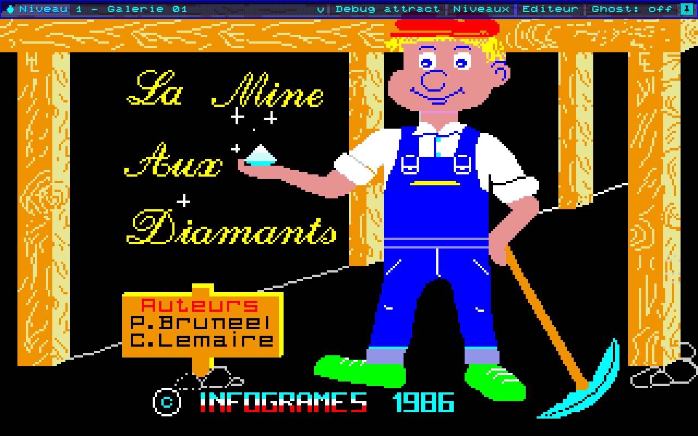
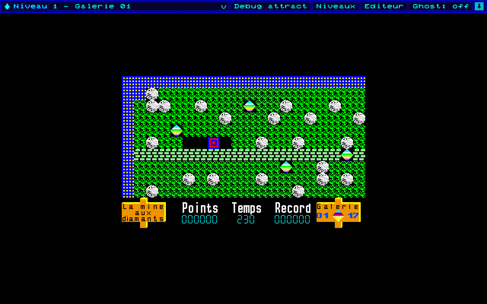
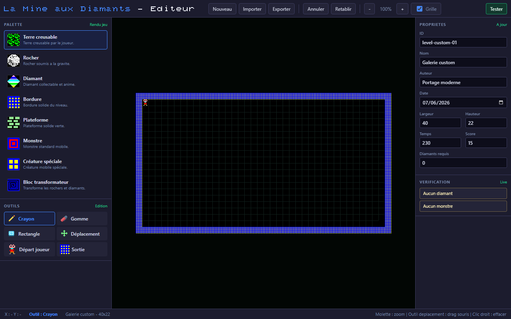

# La Mine aux Diamants TO8 - Portage TypeScript web

Portage moderne en TypeScript de **La Mine aux Diamants**, jeu Thomson TO8 publie par Infogrames en 1986.

Le projet vise un portage jouable dans un navigateur web, avec un rendu proche du TO8 original, tout en s'appuyant sur une architecture moderne, maintenable et outillee.

## Statut

Le jeu est deja jouable dans le navigateur.

Fonctionnalites principales :

- ecran Infogrames et ecran titre;
- mode attract / demo automatique avec niveau cache decode;
- moteur gameplay case par case;
- joueur, rochers, diamants, monstres, creature speciale et bloc transformateur;
- gravite, poussees, explosions, mort/reset, sortie et conversion du temps restant en score;
- HUD TO8 avec score, temps, record, galerie et objectif diamants;
- options accessibles avec `Echap`;
- option de mouvements fluides activable/desactivable;
- options d'affichage: zoom, etirage navigateur sans deformation, densite de cellules;
- vitrine des niveaux avec apercus dynamiques;
- editeur de niveaux JSON integre;
- barre debug avec selection de niveau, attract mode, vitrine, editeur et mode ghost.

Limites connues :

- le cadencement n'est pas encore parfaitement cale sur le TO8 original;
- le son reste une approximation WebAudio moderne;
- certains comportements restent documentes comme hypotheses tant que l'ASM n'est pas totalement tranche;
- la progression/deblocage des niveaux est preparee mais pas encore branchee au gameplay final.

## Apercu

### Ecran titre



### Niveau en jeu



### Editeur de niveaux



## Lancer le projet

Installer les dependances :

```bash
npm install
```

Demarrer le serveur de developpement :

```bash
npm run dev
```

Puis ouvrir :

```text
http://localhost:5173/
```

Construire la version de production :

```bash
npm run build
```

Previsualiser le build :

```bash
npm run preview
```

## Controles

- `Espace` : avancer depuis les ecrans de demarrage.
- Fleches directionnelles : deplacer le personnage.
- `Echap` : ouvrir la pop-in d'options en jeu.

La logique gameplay reste discrete en cellules de grille. La fluidification ne modifie que le rendu visuel des mouvements.

## Modes et outils

### Jeu principal

```text
http://localhost:5173/
```

### URLs directes

```text
http://localhost:5173/?mode=showcase
http://localhost:5173/?mode=editor
http://localhost:5173/?mode=attract
http://localhost:5173/?level=1
```

Sur GitHub Pages, remplacer la base par :

```text
https://karlos-fr.github.io/la-mine-aux-diamants-to8-web/
```

`?level=N` ouvre directement le niveau jouable `N`. Si `level` est valide, il est prioritaire sur `mode`.

### Vitrine des niveaux

Accessible depuis la barre debug avec le bouton `Vitrine`, ou directement avec `?mode=showcase`.

Elle affiche :

- tous les niveaux disponibles;
- un apercu global rendu dynamiquement depuis les JSON;
- nom, auteur, date, temps, objectif diamants;
- fiche detaillee avec score, record, meilleur temps, progression et condition de deblocage;
- bouton `Jouer`.

### Editeur de niveaux

Accessible depuis la barre debug avec le bouton `Editeur`, ou directement avec `?mode=editor`.

L'editeur permet notamment :

- creer/importer/exporter des niveaux JSON;
- peindre les tuiles avec les assets runtime;
- placer spawn joueur et sortie;
- tester temporairement le niveau;
- zoomer/dezoomer et deplacer la vue;
- afficher une vraie grille;
- conserver une bordure non supprimable autour du niveau;
- redimensionner un niveau en deplacant la bordure et en supprimant les objets hors limites.

### Viewer d'animations

```text
http://localhost:5173/?mode=gallery
```

Permet d'inspecter les atlas et animations extraits sans passer par le gameplay.

### Attract mode

```text
http://localhost:5173/?mode=attract
```

Lance directement la demo automatique originale sans attendre le delai de l'ecran titre.

## Architecture

Le code principal est dans `src/`.

```text
src/
  assets/          Assets runtime, niveaux JSON et donnees generees
  audio/           Son WebAudio moderne
  editor/          Editeur de niveaux
  engine/          Boucle, input, renderer canvas et scenes
  game/            Runtime gameplay, grille, timing, systemes
  level-showcase/  Vitrine, progression et previews de niveaux
  rendering/       Rendu gameplay, HUD, entites, tuiles
  screens/         Scenes principales
```

Principes :

- `GameplayScene` orchestre la scene de jeu.
- `GameplayRuntime` garde l'ordre d'update gameplay.
- `runtime-timing.ts` centralise les cadences modernes en ticks TO8.
- les options de fluidification ne changent pas le cadencement logique;
- les niveaux modernes sont des JSON dans `src/assets/levels/`;
- les outils d'edition et de vitrine reutilisent les assets du runtime.

## Niveaux

Les niveaux modernes sont stockes ici :

```text
src/assets/levels/
```

Chaque niveau contient notamment :

- identifiant et libelle;
- auteur et date;
- dimensions;
- temps;
- score par diamant;
- objectif diamants;
- spawn joueur;
- sortie;
- tuiles et entites.

Le format est valide dans :

```text
src/game/level-loader.ts
```

## Extraction et verification

Les assets extraits ou reconstruits sont principalement dans :

```text
docs/extraction/
```

Les outils sont dans :

```text
tools/
```

Scripts utiles :

```bash
npm run extract:assets
npm run extract:fonts
npm run extract:hud
npm run extract:levels
npm run extract:startup
npm run extract:title
```

Verifications :

```bash
npm run test:assets
npm run test:fonts
npm run test:hud
npm run test:levels
npm run test:startup
npm run test:title
npm run test:asset-policy
npm run test:provenance
```

## Documentation

Les plans, analyses et notes techniques sont regroupes dans :

```text
docs/plans/
```

Ce repertoire contient notamment les analyses ASM, les plans d'implementation, les notes de timing, l'audit de la pop-in d'options et les documents lies a l'editeur.

## Fidelite au TO8

Quand un comportement est incertain, la priorite est :

1. verifier l'ASM, les binaires ou les documents d'analyse;
2. comparer avec les assets et metadata extraits;
3. reproduire le comportement dans l'architecture moderne;
4. documenter les hypotheses restantes.

Le portage cherche le pixel-perfect quand les informations source le permettent. Les choix modernes sont separes des comportements ISO.

## Licence et origine

Ce depot est un travail technique de portage, d'analyse et de preservation autour d'un jeu TO8 existant.

Les droits du jeu original, de ses graphismes, de son code, de ses sons, de sa musique et de ses marques restent a leurs ayants droit respectifs.
