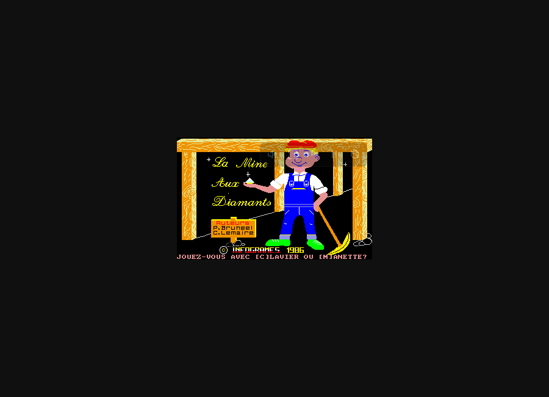
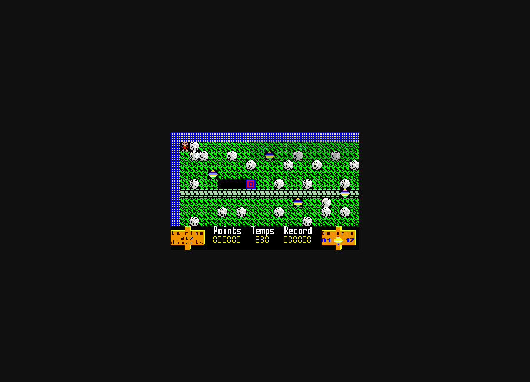

# La Mine aux Diamants TO8 FD - Web Port

This repository contains a static web build of an experimental automatic port of the Thomson TO8 floppy-disk game **La Mine aux Diamants**.

The port was generated with `TO8 Porting Kit v2`, a work-in-progress toolchain that extracts a `.fd` disk image, reconstructs TO8 memory, disassembles Motorola 6809 code, generates TypeScript routines, and bundles them with a browser-based TO8 runtime.

## Screenshots

Title screen:

First level:

## Play

Open the GitHub Pages site for this repository.

Controls used by the generated runtime:

- `Space`: advance from the intro/title prompts
- `C`: keyboard controls
- `Enter`: validate/start
- Arrow keys: move the character
- `Ctrl` or `Space`: action button

## Notes

This is not a hand-written remake. It is an automatic, faithful-porting experiment intended to preserve the original Thomson TO8 program behavior as much as possible in a browser runtime.

The original disk image contains several games and shared binary overlays. This static build deploys the generated web port for **La Mine aux Diamants** with the runtime resources required by the browser version.

## Deployment

The repository is already a static site. GitHub Pages can serve it directly from the repository root.
